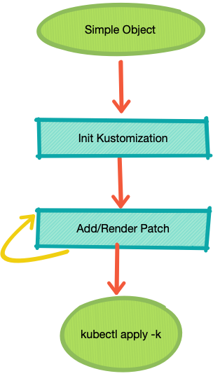

# Kustomize-patch-formulas

Reusable YAML snippet for Kustomize

这个项目有两个目的。

第一点就是，既然有了 [Kustomize](https://github.com/kubernetes-sigs/kustomize)，使用碎片来拼接复杂的 YAML 就很方便了，设想以下情况：

一个只会写简单 Deployment 的小白，随时要去翻书，查查如何加入资源限制，如何加载存储卷，如何设置环境变量....，翻完用完，俩月之后同样的痛苦再来一次，周而复始。。好吧我就是那个小白。

Kustomize 能不能让这个过程舒服一点？

开始摸索 Kustomize 之后，我觉得有救了，只要我把需要的配置碎片积累下来，用的时候稍作修改，然后用 Kustomize 渲染出来，是不是就省了不少麻烦了？另外对一些巨型的 YAML，比如多个 Deployment 和 Service 和 VirtualService 什么的混成一个文件的情况，直接上手修改是很辛苦的，用这种方式也可以方便快捷的进行一些变更。

更近一步的，这些补丁都很小，如果稍稍做点模板处理，用个小脚本加工成正式的 Patch，复用能力会进一步增强。

第二点就是，就算不考虑这些问题，把常见的配置碎片搜集起来也是对 Kubernetes 运维工作很有帮助的。

## 用法

例如我们有一个简单的 Deployment， `/tmp/deploy.yaml`：

~~~yaml
apiVersion: extensions/v1beta1
kind: Deployment
metadata:
  name: flaskapp
spec:
  replicas: 1
  template:
    metadata:
      labels:
        app: flaskapp
        version: v1
    spec:
      containers:
        - name: flaskapp
          image: dustise/flaskapp
          imagePullPolicy: IfNotPresent
          env:
            - name: version
              value: v1
          ports:
            - containerPort: 80
~~~

克隆本项目之后，我们希望借助其中的补丁，为这个对象加入资源限制和 ServiceAccount：

~~~command
$ ./gen_kustomize.py -i /tmp/deploy.yaml -o kust
$ tree kust
kust
├── base
│   ├── deploy.yaml
│   └── kustomization.yaml
└── overlay
~~~

这个命令会为该文件创建一个 Kustomization。其中的 `-i` 参数可以加入多个文件，都会被复制到目标目录（`kust`）的 `base` 之中。

接下来向其中加入补丁：

~~~command
$ ./add_patch.py kubernetes/deployment/resource-patch.yaml \
    --set container_name=flaskapp deployment_name=flaskapp \
    limit_cpu=100m limit_memory=100Mi request_cpu=100m \
    request_memory=100Mi \
    -t kust
$ ./add_patch.py kubernetes/deployment/serviceaccount-patch.yaml \
    --set container_name=flaskapp \
    deployment_name=flaskapp service_account=default \
    -t kust
~~~

这里的第一个参数是补丁文件的位置，`--set` 后面以 `key=value` 的形式为模板进行赋值。模板的写法也很简单，例如：

~~~yaml
apiVersion: extensions/v1beta1
kind: Deployment
metadata:
  name: $deployment_name
spec:
  replicas: 1
  template:
    spec:
      serviceAccount: $service_account
~~~

使用的是 Python 模板，只要简单的在变量前加入 `$` 即可，因为对 Helm 深感疲惫，暂时不准备接入太复杂的模板方式，毕竟补丁本身越小越精确就越好。

加入补丁之后，使用 `kustomize build kust/overlay` 进行渲染：

~~~yaml
apiVersion: extensions/v1beta1
kind: Deployment
metadata:
  name: flaskapp
spec:
  replicas: 1
  template:
    metadata:
      labels:
        app: flaskapp
        version: v1
    spec:
      containers:
      - env:
        - name: version
          value: v1
        image: dustise/flaskapp
        imagePullPolicy: IfNotPresent
        name: flaskapp
        ports:
        - containerPort: 80
        resources:
          limits:
            cpu: 100m
            memory: 100Mi
          requests:
            cpu: 100m
            memory: 100Mi
      serviceAccount: default
~~~

可以看到，这里生成了完整的目标文件。

## 需要贡献

这个项目还非常低级，不堪一用，觉得这个小东西有意思的朋友可以提供：

- 新的补丁模板。
- 测试框架。
- 新的玩法。
- 各种建议。
